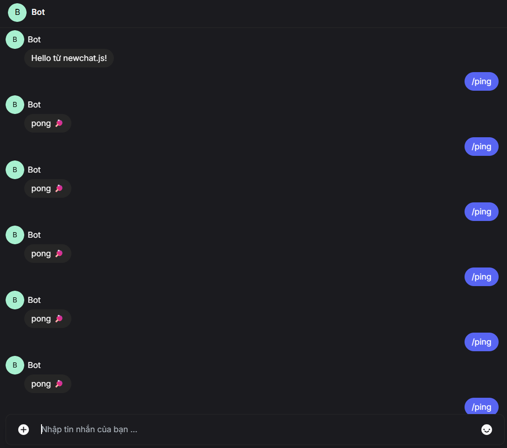
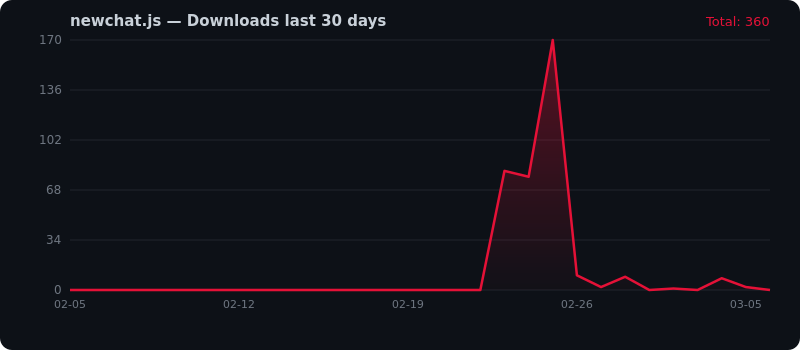

<div align="center">

  <!-- Logo — dark/light theme với drop shadow -->
  <picture>
    <source media="(prefers-color-scheme: dark)" srcset="https://raw.githubusercontent.com/KaiyoDev/newchat.js/main/docs-site/public/logo.svg">
    <source media="(prefers-color-scheme: light)" srcset="https://raw.githubusercontent.com/KaiyoDev/newchat.js/main/docs-site/public/logo.svg">
    
  </picture>

  <h1>newchat.js</h1>
  <p><b>Unofficial Node.js API wrapper for <a href="https://newchat.vn">newchat.vn</a></b></p>

  <p>
    <a href="https://www.npmjs.com/package/newchat.js">
      
    </a>
    <a href="LICENSE">
      
    </a>
    <a href="https://nodejs.org">
      =18"/>
    </a>
    <a href="https://kaiyodev.github.io/newchat.js">
      
    </a>
  </p>

</div>

---

## Cài đặt

```bash
npm install newchat.js
```

---

## Quickstart

```js
const login = require('newchat.js');

const api = await login('email@example.com', 'password');

await api.listen((err, event) => {
  if (err || event.type !== 'message') return;
  if (event.data.isSelf) return;

  if (event.data.body === '/ping') {
    api.sendMessage(event.data.threadID, 'pong 🏓');
  }
});
```

> **Demo:** Bot nhận `/ping` và trả về `pong 🏓`



---

## AppState — Không cần login lại

```js
const fs = require('fs');
const { loadAppState } = require('newchat.js');

// Lưu session
const api = await login('email@example.com', 'password');
fs.writeFileSync('appstate.json', JSON.stringify(api.getAppState()));

// Lần sau dùng lại
const api = await loadAppState(JSON.parse(fs.readFileSync('appstate.json')));
```

---

## API

| Hàm | Mô tả |
|-----|-------|
| `login(email, password)` | Đăng nhập, trả về api object |
| `loadAppState({ token })` | Khôi phục session từ token |
| `api.getAppState()` | Lấy `{ token }` để lưu |
| `api.listen(callback)` | Lắng nghe events realtime qua WebSocket |
| `api.sendMessage(threadID, text)` | Gửi tin nhắn văn bản |
| `api.sendAttachment(threadID, filePath, caption?)` | Gửi file/ảnh |
| `api.markAsRead(threadID)` | Đánh dấu đã đọc |
| `api.getThreadList()` | Danh sách cuộc trò chuyện |
| `api.getThreadHistory(threadID, options?)` | Lịch sử tin nhắn |
| `api.getUserInfo()` | Thông tin tài khoản đang đăng nhập |
| `api.getMyProfile()` | Alias của `getUserInfo()` |

Xem đầy đủ tại **[docs site](https://kaiyodev.github.io/newchat.js)**.

---

## Cấu trúc dự án

```
newchat.js/
├── src/
│   ├── index.js          # Entry point — login(), loadAppState()
│   ├── httpUtils.js      # Axios instance + setToken()
│   ├── wsClient.js       # WebSocket — Socket.IO v4 + MessagePack
│   └── api/
│       ├── listen.js
│       ├── sendMessage.js
│       ├── sendAttachment.js
│       ├── markAsRead.js
│       ├── getThreadList.js
│       ├── getThreadHistory.js
│       └── getUserInfo.js
├── docs-site/            # VitePress documentation
├── DOCS.md               # API reference đầy đủ
├── test.js               # Test script
└── package.json
```

---

## Kiến trúc

```
REST  →  https://api.newchat.vn   (Bearer JWT)
WS    →  wss://ws.newchat.vn      (Socket.IO v4 + MessagePack binary)
```

**WebSocket auth flow:**
1. Server gửi EIO OPEN (`0{sid,...}`)
2. Client gửi binary msgpack `{ type:0, data:{token}, nsp:"/" }`
3. Server xác nhận CONNECT ACK
4. Server push `channel:message` events

---

## Thống kê Download

<div align="center">

[](https://www.npmjs.com/package/newchat.js)
[](https://www.npmjs.com/package/newchat.js)
[](https://www.npmjs.com/package/newchat.js)

<a href="https://npmtrends.com/newchat.js">
  
</a>


</div>

---

## Build & Phát triển

```bash
# Cài dependencies
npm install newchat.js

# Chạy test (ping/pong bot)
node test.js

# Build docs
cd docs-site && npm run build
```

---

## License

MIT © [KaiyoDev](https://github.com/KaiyoDev)

> ⚠️ Unofficial — không liên kết với đội ngũ newchat.vn. API có thể thay đổi bất kỳ lúc nào.

## Contributors ✨

Thanks goes to these wonderful people ([emoji key](https://allcontributors.org/docs/en/emoji-key)):

<!-- ALL-CONTRIBUTORS-LIST:START - Do not remove or modify this section -->
<!-- prettier-ignore-start -->
<!-- markdownlint-disable -->
<table>
  <tbody>
    <tr>
      <td align="center" valign="top" width="14.28%"><a href="https://github.com/KaiyoDev"><br /><sub><b>Đặng Hoàng Ân</b></sub></a><br /><a href="https://github.com/KaiyoDev/newchat.js/commits?author=KaiyoDev" title="Code">💻</a> <a href="https://github.com/KaiyoDev/newchat.js/commits?author=KaiyoDev" title="Documentation">📖</a> <a href="#maintenance-KaiyoDev" title="Maintenance">🚧</a></td>
    </tr>
  </tbody>
</table>

<!-- markdownlint-restore -->
<!-- prettier-ignore-end -->

<!-- ALL-CONTRIBUTORS-LIST:END -->

This project follows the [all-contributors](https://github.com/all-contributors/all-contributors) specification. Contributions of any kind welcome!